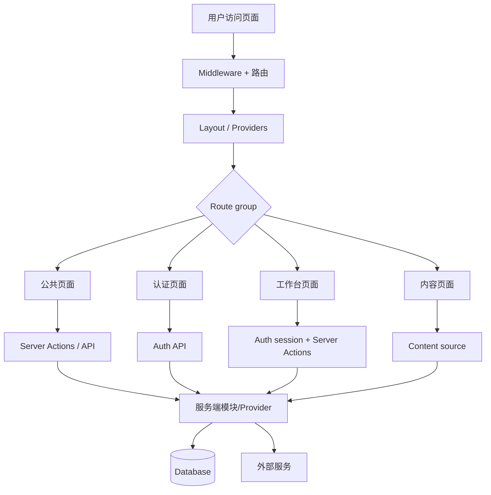

# Logic Map

本文件是项目业务逻辑地图的根索引，只展示全貌和阅读顺序。模块细节、页面到服务端的调用顺序、流程图和维护规则都放在 `docs/logic-map/` 下。

逻辑地图描述的是功能逻辑和调用关系，不描述源码实现。文档可以提到路由、页面、Action、Provider、表、方法名和配置名，方便 Agent 回到代码中查看，但不要粘贴代码片段。

## 阅读顺序

1. 先读 [编号规范](./logic-map/NUMBERING.md)，确认模块编号和两级文档结构。
2. 再读本文件，判断需求或 Bug 属于哪个业务模块。
3. 进入对应**模块索引页**（如 `A-global-routing.md`），根据编号段分配表找到具体的**二级文档**。在二级文档中沿着"页面入口 -> 用户动作 -> 服务端入口 -> 数据/外部服务 -> 结果状态"阅读调用链路。
4. 修改业务逻辑后，同步更新对应的二级文档和模块索引页；如果出现新的业务闭环，先按编号规范新增二级文档或新模块。

## 模块总览

| 编号 | 模块 | 文档 | 覆盖范围 |
| --- | --- | --- | --- |
| A | 全局骨架 | [A-xxx.md](./logic-map/A-xxx.md) | 路由、i18n、布局、配置、Provider |
| B | 公共页面 | [B-xxx.md](./logic-map/B-xxx.md) | 首页、营销页、定价页、法务页 |
| C | 认证账户 | [C-xxx.md](./logic-map/C-xxx.md) | 登录、注册、OAuth、邮箱、会话 |
| D | 工作台 | [D-xxx.md](./logic-map/D-xxx.md) | Dashboard、Settings、Admin |
| E | 商业闭环 | [E-xxx.md](./logic-map/E-xxx.md) | 支付、订阅、积分、webhook |
| F | 内容与接口集成 | [F-xxx.md](./logic-map/F-xxx.md) | Blog、Docs、Storage、Mail、Cron |

> 上表为模板占位，实际文件名根据项目具体模块命名，如 `A-global-routing.md`、`B-public-pages.md` 等。

## 全局调用图

## 维护规则速记

- 新需求：先在本索引中定位模块编号，再读模块文档中的流程图和影响范围。
- Bug 修复：先从用户看到的页面或 API 入口反查到服务端动作、数据表和外部服务。
- 删除功能：同步删除或标记逻辑地图中对应入口、调用链和维护注意事项。
- 新增功能：优先扩展已有模块；只有形成独立业务闭环时才新增模块文件。
- 文档更新：保持编号稳定，避免因重排破坏历史引用。
