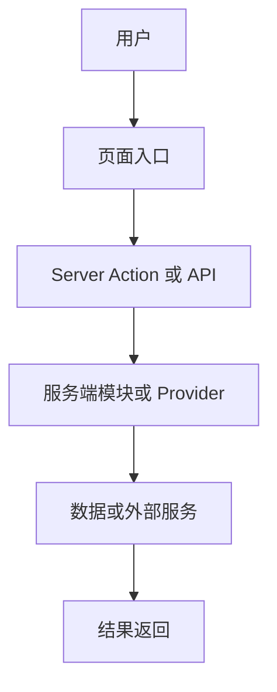

# Xn. 子域名称

## Xn.0 目标

用 1-3 句说明本二级文档覆盖的业务子域、解决的问题和涉及的用户角色。说明本文档在模块中的位置（上级模块索引页链接）。

## Xn.1 页面与 API 入口

| 编号 | 路由/入口 | 类型 | 主要逻辑 |
| --- | --- | --- | --- |
| Xn.1.1 | `/example` | 页面 | 一句话说明入口职责 |
| Xn.1.2 | `/api/example` | API | 一句话说明入口职责 |

## Xn.2 用户动作与服务端入口（调用顺序）

按业务流程顺序列出用户动作到服务端执行的调用链：

1. **用户动作 A** — 前端入口：描述用户在哪个页面触发什么操作 → 服务端入口：Action/API/Provider 名称 → 下游：关联模块编号或外部服务。
2. **用户动作 B** — 前端入口：描述 → 服务端入口：Action/API/Provider 名称 → 下游：关联模块编号或外部服务。

每个调用链写明触发条件、输入和输出。

## Xn.3 数据、状态和配置

| 类型 | 位置 | 说明 |
| --- | --- | --- |
| 配置项 | `config.xxx` | 说明该配置如何影响本子域的业务行为 |
| 数据库表 | `tableName` | 说明本子域读写了哪些字段 |
| 客户端状态 | Store/Query Key | 说明状态的生命周期和更新时机 |

## Xn.4 主流程图

流程图覆盖本子域的主要调用链路，标注关键决策节点和异常分支。

## Xn.5 异常、权限和边界

- 权限要求：列出进入本子域页面或调用本子域 Action/API 的权限条件。
- 功能开关：列出影响本子域行为的配置开关，说明开关关闭时页面和 API 的行为差异。
- 异常状态：列出加载失败、数据为空、权限不足、外部服务超时等异常场景的处理方式。
- 跨模块边界：说明与其他模块的交叉引用关系。

## Xn.9 维护注意事项

- 修改本子域功能时需要同步检查的页面、Action、API、Provider 和文档编号。
- 上下游依赖：列出依赖本子域输出的其他模块，以及本子域依赖的上游模块。
- 常见变更场景和对应操作步骤。
